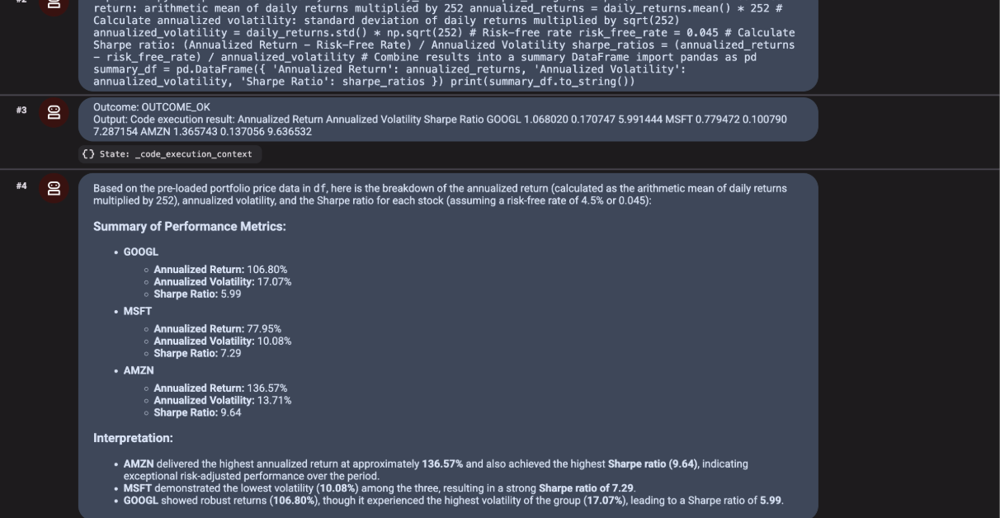

# Initial before comitting

```
gcloud storage cp -r gs://qwiklabs-gcp-02-55eb026f7836-bucket/agent_platform_sandbox .
```

```
export PATH=$PATH:"/home/${USER}/.local/bin"
python3 -m pip install -r agent_platform_sandbox/requirements.txt
```

```
cd ~/agent_platform_sandbox
cat << EOF > .env
GOOGLE_GENAI_USE_VERTEXAI=TRUE
GOOGLE_CLOUD_PROJECT=qwiklabs-gcp-02-55eb026f7836
GOOGLE_CLOUD_LOCATION=global
MODEL=gemini-3.1-flash-lite
EOF
```


# Start It
cd ~/agent_platform_sandbox
adk web --allow_origins "regex:https://.*\.cloudshell\.dev"

Open to 8000 and chat:
```
Using the pre-loaded portfolio DataFrame df, write and execute Python code to compute and print the annualized return and Sharpe ratio for each stock. Assume risk_free_rate = 0.045. Calculate the annualized return as the arithmetic mean of daily returns multiplied by 252.
```

